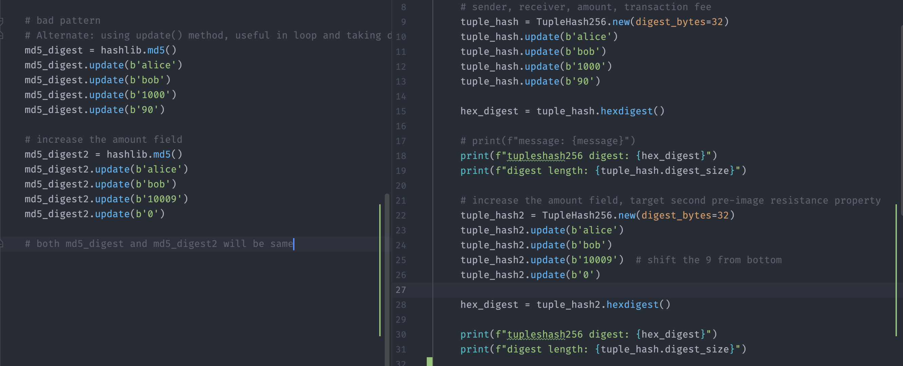

# Hash Function

## Hash function and Integrity

1. In the context of practical crypto, hash functions cannot be relied upon alone.
2. The intended objective of file download and hash checking feature:
   1. The digest is closely tied to the file you’re downloading.
   2. no attacker should be able to fool you by giving you a different file that means `second` pre-image resistance property must be satisfied.
   3. However, an attacker could perform a Man-in-the-Middle (MITM) attack or compromise the website, allowing them to replace both the file and its associated hash.
   4. To ensure the integrity and authenticity of the downloaded file, we need to rely on `trusted mechanisms` such as
      1. Transport Layer Security (TLS) and
      2. hosting sites that cannot be compromised.
3. Message Authentication Code (MAC) addresses this issue by incorporating `secrets`, providing a solution that ensures both integrity and authenticity.
   1. The same we can achieve by signing the hash with private key(digital signature).

## Checksum

* Checksum term should only be used for non crypto context.
* Checksums are primarily used for `error detection` in data `transmission` or storage.
  * They are designed to quickly identify accidental errors or corruption in data.
* Checksum algorithms are often simpler and faster to compute.
* They don't follow the hash property. In some cases, different inputs may produce the same checksum, leading to a collision.
  * Example, CRC32.

## Encoding and Hash Output

> The number of human-readable characters depends on the `character set`.
>
> ASCII consists of 128 characters however Unicode encompasses thousands of characters, making it more comprehensive than ASCII.

* The larger the base, the less space it takes to `display a binary string`.
* Base64 is commonly used to represent `binary data` in a human-readable format by using a set of 64 characters (hence the name Base64).
* Base64 is not designed to extend the character set beyond the existing human-readable characters. Instead, it aims to encode binary data into a format that is safe for transmission over systems that may interpret binary data differently.
* Base64 encoding is commonly used as a output of hash functions.

## Hash functions as Random Oracles

* Although the hash functions are designed in such a way that their digests are `unpredictable` and random but still we can't replace `Random Oracles` with real hash functions.
* However, `sponge construction` closely behaves like random oracle as long as the permutation used by the construction is random enough.

## Challenges to upgrade hash function

1. Support backward compatibility

```bash
# verify the digest of a downloaded file
openssl dgst -sha256 downloaded_file
```

## Size of hash / digest

* The input of hash function can be of any size.
  * It can even be `empty`.
* The output is always of the same length and `deterministic`

## Usage of Hashing function

1. Commitment scheme: `Hiding with Binding`
   * Guarded by Pre-image resistance: By making a commitment we are hinding the actual input inside output / digest. For example, I am forcasting Stock X will reach $50 next month.
   * Guarded by Second pre-image resistance: Binding only a single input to the digest.
2. `Subresource integrity check`: when web pages import external JavaScript files / libraries.

## Hash properties

### 1. Pre-image resistance

No one should be able to `reverse` the hash function in order to `recover` the `input` from the output.

* This is also called `one-way` / irreversible property.
* It is always possible to find the plain text from a digest if that plain text is small (brute force the space) or predictable (use dictionary) to fill up a rainbow table and reverse lookup.
  * However, here we are tying to mean, if the digest is generated from a large / un-predictable(i.e not from dictionary words) text then just by knowing the hash, we can't `recover` the plain text.

### 2. Second pre-image resistance

Knowing the `plain text` and the `hash` both, no one should be able to find `another input` that produces the `same` hash.

### 3. Collision resistsnce

No one should be able to `produce two different input` that generates the same hash output.

#### The primary difference with `Second pre-image resistance` property:

* Here an attacker is `free to choose` any two different inputs to `produce` the same hash. but in `Second pre-image resistance`, one input and it's hash both are `fixed`, knowing those two information, the attacker needs to find another input that generates the same hash.

> These last two propertes are merely saying that it should be `extreamly hard` to find another input / two inputs. `Extreamly hard` means => it is practically impossible but not theoretically possible.
>
> Because end of the day, all hash functions are `compressing` the input.

#### 4. Other properties

1. `Deterministic`: the same input message should always result in the same hash value.
2. Quick: it should be fast to compute the hash value for any given message.
   1. Slow: required for password
3. `Avalanche Effect` / Hard to analyze: a small change to the input message should totally change the output hash value.

## Can we truncate the hash as per our choice

Lets assume,

1. We generate multiple digests using random inputs.
2. The size of our digests is set to N bits, which means there are a total of 2^N `unique` possibilities.
3. According to the "birthday bound" concept, if there are only 23 people in a room, there is a 50% chance that two people share the same birthday.
   1. Similarly, following the "birthday bound," there is a 50% probability of encountering a collision after generating 2^(N/2) strings.

In simpler terms, if we set the digest size to a minimum of 256 bits or 32 bytes, it would require someone to perform a minimum of 2^128 operations to find a collision with a 50% probability.

Performing 2^128 operations or pre-computing 2^128 strings would take an incredibly long time and is virtually impossible given the capabilities of today's standard computers. Due to this fundamental reason, all real world crypto algorithms aim for 128 bit security.

When we don't require a specific hash property to satisfy, we have the option to shorten the hash output or reduce its size.

Digest size: minimum requirement

1. Pre-image resistance: 128 bit
2. Second Pre-image resistance: 128 bit
3. Collision resistance: 256 bit

For example: onion address => organization creates `base32` representation of hash contains the same name of the website. This type of website address is called `onion` / `vanity` address.

1. They generate lots of public keys until one ended up hashing to a cool base32 representation.
2. They can also truncate the hash to achieve cool base32 representation because this hash does not need to meet collision resistance property.

### When we need `fast` hashing algorithm

if you are using it to compute the secure hash of a large amount of data, such as

1. in distributed filesystems (e.g. Tahoe-LAFS),
2. cloud storage systems (e.g. OpenStack Swift),
3. intrusion detection systems (e.g. Samhain),
4. integrity-checking local filesystems (e.g. ZFS),
5. peer-to-peer file-sharing tools (e.g. BitTorrent), or
6. version control systems (e.g. git).

## Unkeyed Hashing Algorithms

1. MD5
   1. Collision resistance: has been broken and attacked.
      1. For example, I get a md5 hash and luckly during rainbow attack I found `abcd` password also produce the same hash where as the actual password of the hash was different.
   2. Pre-image-resistance: In April 2009, an attack against MD5 was published that breaks MD5's preimage resistance. This attack is only `theoretical`, with a computational complexity of 2123.4 for full preimage.
   3. 2nd pre-image resistance property does not impacted by any attack.
   4. Therefore, technically still it is safe to use in the context when we don’t need its collision resistance and Pre-image-resistance property.
   5. An MD5 hash is 16 bytes. Each MD5 hash `looks like 32 numbers and letters`, but each digit is in hexadecimal and represents four bits. Since a single character represents eight bits (to form a byte), the total bit count of an MD5 hash is 128 bits. Two hexadecimal characters form a byte, so 32 hexadecimal characters equal 16 bytes.
2. SHA1
   1. **SHAttered Attack (2017):** Researchers from Google and the CWI Institute in Amsterdam successfully executed a practical collision attack named SHAttered in 2017. They were able to generate two different PDF files with the same SHA-1 hash,
3. SHA256 / SHA\_512
   1. SHA1, SHA2 both use the `Merkle-Damgard` construction that makes vulnerable to `hash length extension` attack.
   2. other hash properties are not broken yet therefore it is `widely` used in `without-keyed hashing` context.
4. SHA3 came with multiple variant to support `XOF like` concept - sha3\_224, sha3\_256, sha3\_384, sha3\_512.
   1. Build with `sponge construction` (ingesting input: absorbing, creating digest: squeezing).
   2. Due to this it is not vulnerable to hash length extension attack.
   3. `Cut down digest property`: Shorter hashes(sha3\_256) are NOT prefixes of longer hashes(sha3\_512).
5. SHAKE\_256 - came with one algo that supports XOF
   1. SHAKE uses the same construction used by SHA3 except it is faster
   2. XOF - variable length output, min=0, max=no\_limit, openssl\_default=32 bytes
   3. `Cut down digest property`: Shorter hash outputs are prefixes of longer hash outputs.
6. cSHAKE - customizable SHAKE
   1. Uses a custom / personalization string to support `domain separation`.
   2. `Cut down digest property`: Shorter hash outputs are prefixes of longer hash outputs.
   3. This should not be used as keyed hashing algo by utilizing the custom string property.
      1. Use dadicated KMAC algo(backed by cSHAKE) supports keyed hashing.

> Domain Separation
>
> In order to make a proof of work, either
>
> 1. use different hash functions OR
> 2. use different keys
>
> Useful when we `reuse` same crypto primitives(i.e fundamental building blocks or components) for different use cases.

7. TupleHash
   1. Usecase: produce digest for multiple values concatinate together via `update() function` to generate the proof / thumbprint.
   2. Directly add the parameters without worried about `length` and `de-marking` character.
   3. Preventing ambigious hashing / `hash confusion` attack.


